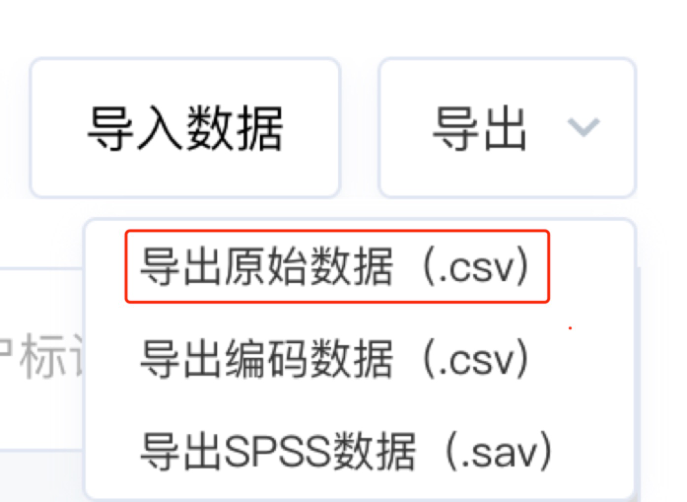
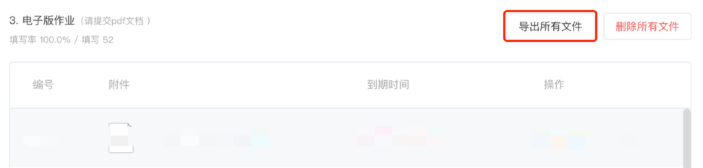
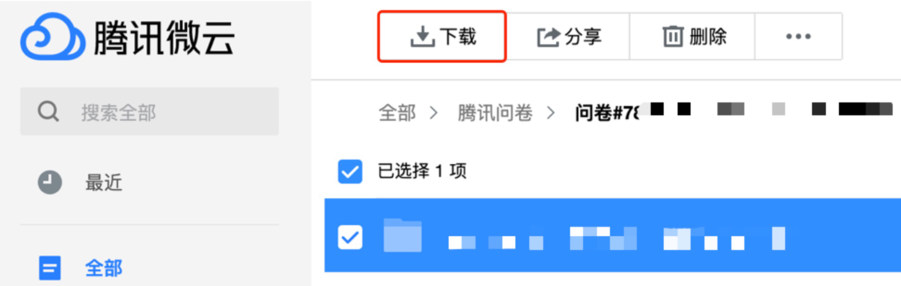

# Homeworks Wrapper

本脚本用于处理腾讯问卷上收集的作业，主要是重命名文件和做未交情况统计。

> 问卷中应至少包含姓名和学号两题，用于分辨附件的提交者

### 推荐文件组织层次

```
.
├── classmates.csv         # 全班同学名单，至少包含"学号"和"姓名"两列，次序不重要
├── homeworks.py           # 本脚本
└── Math01                 # 某次作业的文件夹
     ├── xxxxxxx_xxx.csv   # 后台导出的.csv文件，至少包含"学号"、"姓名"、"作业"三题的结果，含关键字即可
     ├── xxxxxxx_xxx.pdf   # 其他附件
     ├── xxxxxxx_xxx.png
     ├── xxxxxxx_xxx.jpg
     ├── xxxxxxx_xxx.doc
     └── xxxxxxx_xxx.docx
```

### 用法

先从问卷后台的"回收数据"导出统计情况，注意选择导出原始数据



再从问卷后台的"统计图表"导出所有附件



或从微云下载整个文件夹中的所有附件



将压缩包解压成如上的推荐文件组织层次，使用如下命令进行处理

```shell script
python homeworks.py -p Math01
```

**详细参数**

```shell script
python homeworks.py -h       

usage: homeworks.py [-h] [-p FOLDER] [-c CLASSMATES] [-d] [-v]

optional arguments:
  -h, --help            show this help message and exit
  -p FOLDER, --folder FOLDER
                        Name of folder which containing homeworks, default =
                        os.getcwd() (the working path)
  -c CLASSMATES, --classmates CLASSMATES
                        Filename of which containing all classmates'
                        information, default = os.getcwd() (the working path)
  -d, --directly        File IS downloaded directly from Tencent WenJuan or
                        NOT (from Tencent WeiYun), default: Not (from WeiYun)
  -v, --verbose         Print student name or NOT, default: Not

```

### 样例输出

> 如下例子仅作参考

收齐的情况

```shell script
python homeworks.py -p Math03
Math03 - 目前已接收53份作业

本周已收齐
```

未收齐的情况，不展示缺交同学名字

```shell script
python homeworks.py -p Math04
Math04 - 目前已接收48份作业

未收到学号
========
20216xxx
20216xxx
20216xxx
20216xxx
20216xxx
```

未收齐的情况，展示缺交同学名字

```shell script
python homeworks.py -p Math04 -v
Math04 - 目前已接收48份作业

未收到学号
========
20216xxx  xxx
20216xxx  xx
20216xxx  xx
20216xxx  xxx
20216xxx  xxx
```